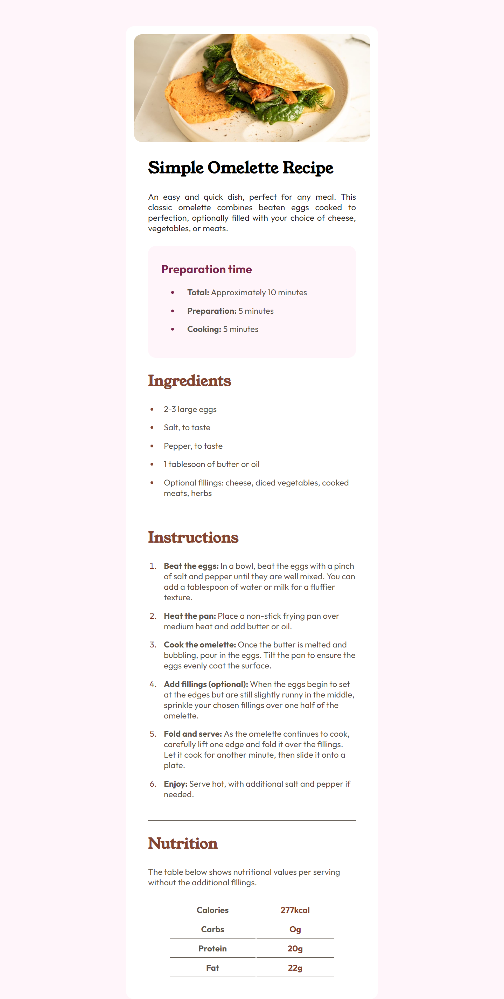
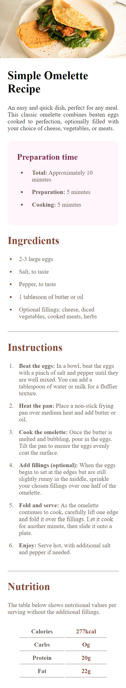

# Frontend Mentor - Recipe page solution

This is a solution to the [Recipe page challenge on Frontend Mentor](https://www.frontendmentor.io/challenges/recipe-page-KiTsR8QQKm). Frontend Mentor challenges help you improve your coding skills by building realistic projects.

## Table of contents

- [Overview](#overview)
  - [The challenge](#the-challenge)
  - [Screenshot](#screenshot)
  - [Links](#links)
- [My process](#my-process)
  - [Built with](#built-with)
  - [What I learned](#what-i-learned)
  - [Continued development](#continued-development)
  - [Useful resources](#useful-resources)
- [Author](#author)

**Note: Delete this note and update the table of contents based on what sections you keep.**

## Overview

### Screenshot




### Links

- Solution URL: [Add solution URL here](https://your-solution-url.com)
- Live Site URL: [Add live site URL here](https://your-live-site-url.com)

## My process

### Built with

- Semantic HTML5 markup
- CSS custom properties
- Mobile-first workflow

### What I learned

Use this section to recap over some of your major learnings while working through this project. Writing these out and providing code samples of areas you want to highlight is a great way to reinforce your own knowledge.

To see how you can add code snippets, see below:

```css
body {
  font-family: Outfit;
  font-weight: 400;
  background-color: var(--rosewhite);
}
.main-container {
  width: 50%;
  margin: 0 auto;
  background-color: var(--whiteColor);
  padding: 15px;
  border-radius: 15px;
  margin-top: 50px;
}
```

### Continued development

Use this section to outline areas that you want to continue focusing on in future projects. These could be concepts you're still not completely comfortable with or techniques you found useful that you want to refine and perfect.

### Useful resources

- [Example resource 1](https://www.frontendmentor.io/) - This helped me for XYZ reason. I really liked this pattern and will use it going forward.
- [Example resource 2](http://www.w3schools.com/) - This is an amazing article which helped me finally understand XYZ. I'd recommend it to anyone still learning this concept.

## Author

- Website - [Frontend Mentor](https://www.frontendmentor.io/)
- Frontend Mentor - [@samiuzaman](https://www.frontendmentor.io/profile/samiuzaman)
- Twitter - [@samiuzzaman201](https://www.twitter.com/samiuzzaman201)
